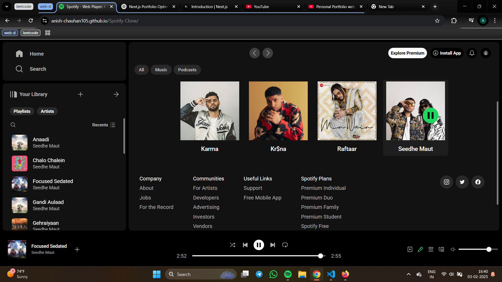
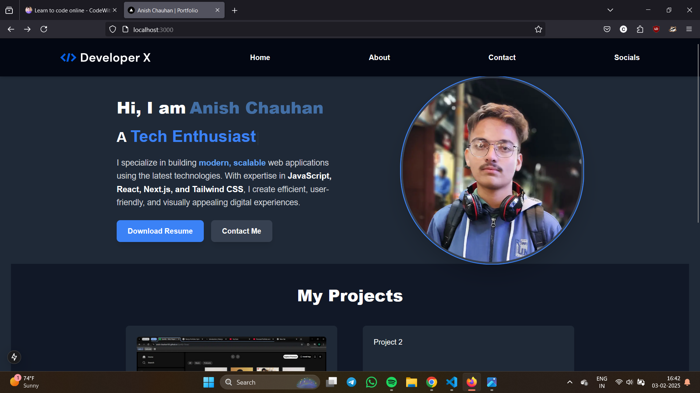

# 🎵 Spotify Clone Frontend

A fully responsive Spotify clone built with **HTML, CSS, and JavaScript**. This project mimics the core functionalities of a music player, including playback controls, seek bar, volume adjustments, and local storage for managing songs.

## 🔗 Live Demo

[🎧 View the Live Website](https://your-live-demo-link.com)

## 📸 Screenshots

| Home Page | Player Page |
| --------- | ---------- |
|  |  |

## 🛠️ Features

- ✅ **Play, Pause, Next, Previous** track controls
- 🎵 **Seek Bar** to scrub through songs
- 🔊 **Volume Control** with mute/unmute support
- 📂 **Local Storage** for song management

## 🚀 Future Enhancements

- 🔹 **Playlist Support**
- 🔹 **Enhanced UI/UX Features**
- 🔹 **More Advanced Player Functionalities**

## 📂 Project Structure

```
📁 spotify-clone
 ┣ 📂 songs
 ┃ ┣ 📂 artist
 ┃ ┃ ┣ 📄 cover.jpg
 ┃ ┃ ┣ 📄 song.jpg
 ┃ ┃ ┗ 📄 bgcover.jpg
 ┣ 📂 assets
 ┣ 📂 scripts
 ┣ 📂 styles
 ┣ 📄 index.html
 ┣ 📄 README.md
```

## 🚀 Getting Started

### 1️⃣ Clone the Repository

```sh
git clone https://github.com/ANISH-CHAUHAN105/Spotify-Clone.git
cd Spotify-Clone
```

### 2️⃣ Open in Browser
Simply open `index.html` in your preferred browser.

## 📜 License

This project is licensed under the **MIT License**.

## 💡 Contributing

1. **Fork** the repository.
2. **Create** a new branch: `git checkout -b feature-branch`.
3. **Commit** your changes: `git commit -m "Add feature"`.
4. **Push** to the branch: `git push origin feature-branch`.
5. **Create a Pull Request** on GitHub.

## 📞 Contact

- **GitHub**: [@ANISH-CHAUHAN105](https://github.com/ANISH-CHAUHAN105)
- **Email**: [canish005@gmail.com](mailto:canish005@gmail.com)

